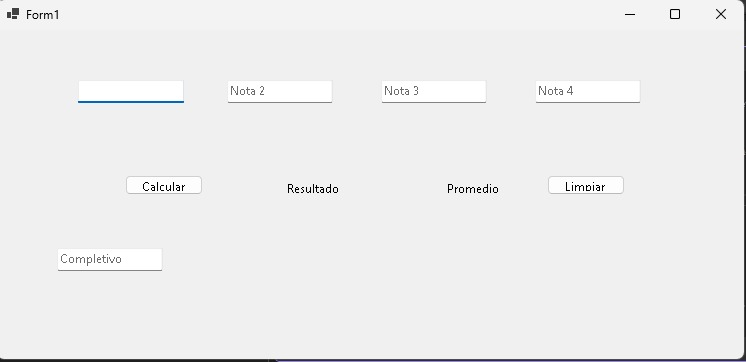

# Calificaciones y Promedios

 Esta es la asignacion de la tarea de calificaciones y promedio en el cual se pueden añadir 4 notas y definir el promedio de calificaion de un estudiante y si este posee los puntos suficientes para pasar y si no los tiene se activara el completivo en el cual se necesitan las calificaciones para mostrar. 
  
